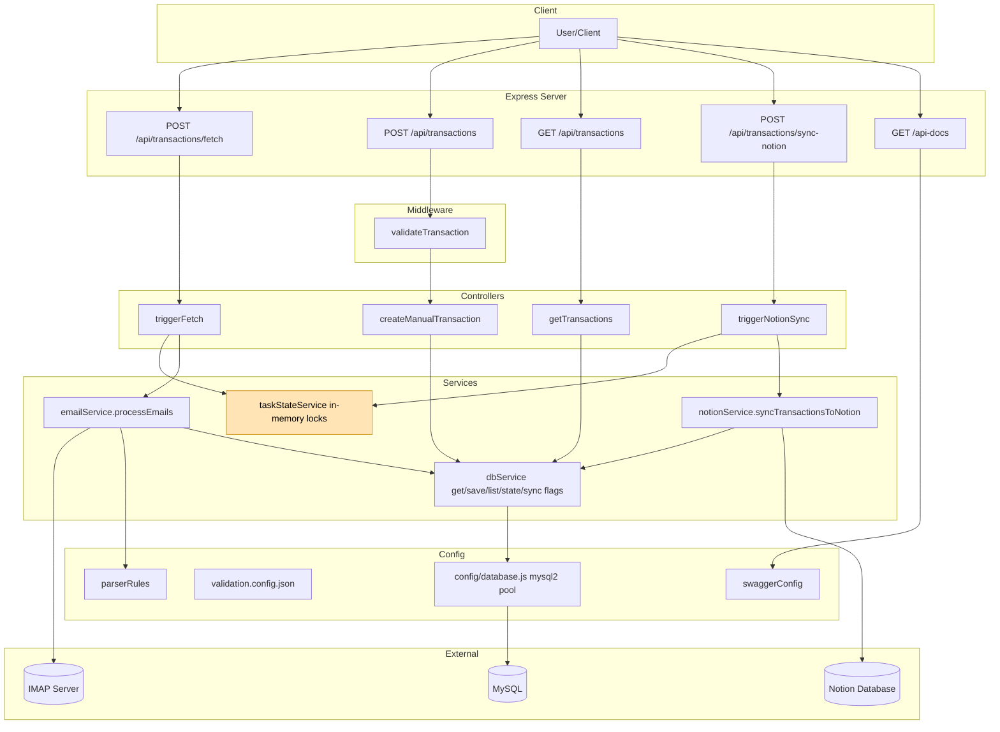

# Project Context: Email Transaction Tracker API

A Node.js + Express API that fetches bank transaction emails (BCA, Mandiri) via IMAP, parses essential fields, stores them in MySQL, allows manual inserts, lists transactions with filtering/pagination, and can sync unsynced rows to a Notion database. Swagger docs are auto-generated.

---

## High-level Architecture
- Web server: Express (src/index.js)
- Routing: src/routes/transactionRoutes.js
- Controllers: src/controllers/transactionController.js
- Middleware: input validation (src/middleware/validation.js)
- Services:
  - Email fetch/parse: src/services/emailService.js
  - DB access + pagination/filters + app state: src/services/dbService.js
  - In-memory task locks: src/services/taskStateService.js
  - Notion sync: src/services/notionService.js
- Config:
  - DB pool: src/config/database.js
  - Swagger: src/config/swaggerConfig.js
  - Parsing rules (regex/subjects): src/config/parserRules.js
  - Validation config (allowed enums): src/config/validation.config.json
|- Migrations: db-migrate (migrations/*)

## Architecture Flow

---

## Data Model (MySQL)
Tables created by migrations/sqls:

1) transactions
- id INT PK AUTO_INCREMENT
- bank VARCHAR(20) NOT NULL
- type VARCHAR(50) NOT NULL
- transaction_date DATETIME NOT NULL
- amount DECIMAL(15,2) NOT NULL
- description TEXT
- created_at TIMESTAMP DEFAULT CURRENT_TIMESTAMP
- flow ENUM('IN','OUT') NOT NULL  (added by 20251012031420)
- is_synced_to_notion BOOLEAN NOT NULL DEFAULT FALSE  (added by 20251026094618)
- INDEX idx_synced (is_synced_to_notion)

2) app_state
- key_name VARCHAR(50) PK
- key_value VARCHAR(255)
  - Stores 'last_fetch_timestamp' used to avoid re-processing emails.

Initial seed: app_state.last_fetch_timestamp defaults to NOW() - 7 days on first migration.

---

## Environment Variables
Create .env from .env.example and add the following (examples only):

Server
- PORT=3000

Database (used by db-migrate and runtime pool)
- DB_HOST=...
- DB_PORT=3306
- DB_USER=...
- DB_PASSWORD=...
- DB_NAME=...

IMAP (Gmail tested)
- IMAP_USER=...
- IMAP_PASSWORD=...  (App Password recommended with 2FA)
- IMAP_HOST=imap.gmail.com
- IMAP_PORT=993
- IMAP_TLS=true

Notion
- NOTION_API_KEY=...
- NOTION_DATABASE_ID=...

---

## Key Flows

### 1) Email Fetch & Parse -> Save
File: src/services/emailService.js
- Locking: Uses taskStateService (in-memory Set) to prevent concurrent runs.
- Reads last_fetch_timestamp (Date) from DB (dbService.getLastFetchTimestamp()).
- IMAP search criteria: SINCE <date-part of last_fetch_timestamp> AND (FROM bca@bca.co.id OR noreply.livin@bankmandiri.co.id)
- Parses messages via mailparser.simpleParser.
- Filters out emails with parsedEmail.date <= last_fetch_timestamp (prevents duplicates within same day bucket).
- Converts HTML to text with html-to-text (skips images and link hrefs).
- Parses subject/body using PARSER_RULES (src/config/parserRules.js):
  - Banks supported: BCA, Mandiri (OUT flows for now)
  - Per bank+subject rule: regex extracts amount and description_target
  - Description is templated (e.g., "Transfer ke {{description_target}}")
  - Amount parser supports both 1.234,56 and 1,234.56 formats
  - transaction_date uses the email's Date header
  - flow comes from the rule
- On success: saveTransaction(transaction)
- After loop: updateLastFetchTimestamp() upserts the new timestamp
- Always ends lock and closes IMAP connection

Notes:
- Last-fetch logic mixes IMAP's day-level SINCE filter with exact timestamp check using parsedEmail.date.
- If no app_state row, it fetches since epoch (1970-01-01) and creates/updates the state afterward.
- Current PARSER_RULES cover common OUTgoing cases (QRIS/Payment/Transfer; BCA & Mandiri). Add more rules as needed.

### 2) Manual Transaction Creation
- Route: POST /api/transactions
- Middleware: validateTransaction enforces:
  - amount: positive number
  - description: non-empty string
  - flow: one of config.allowed_flows (IN, OUT)
  - bank (optional): must be in allowed_banks if provided (BCA, Mandiri)
  - transaction_date (optional): ISO 8601 if provided
- Controller assembles payload with defaults: bank="Manual" and type from transaction_type (or "Manual Input"), transaction_date defaults to now if missing.
- Persists via dbService.saveTransaction().

### 3) Transactions Listing (Filters + Pagination)
- Route: GET /api/transactions
- Query params: page, limit, flow, description (LIKE), date_start, date_end, amount_start, amount_end
- dbService.buildWhereClause builds parameterized WHERE
- Returns { pagination: {totalItems, totalPages, currentPage, itemsPerPage}, data: [...] }
- Ordered by transaction_date DESC

### 4) Notion Sync
- Route: POST /api/transactions/sync-notion
- Locking: taskStateService prevents concurrent syncs
- Loads up to 50 unsynced rows (is_synced_to_notion = FALSE), ascending by transaction_date
- For each row, creates a Notion page in DATABASE_ID with properties: Description (title), Amount (number), Flow (select), Bank (select), Type (select), Transaction Date (date), MySQL_ID (number)
- Successful IDs are marked as synced in batch: UPDATE ... SET is_synced_to_notion=TRUE WHERE id IN (...)

---

## HTTP API Summary
Base URL: http://localhost:3000

- GET /
  - Health check: { message: 'Transaction Tracker API is running.' }

- POST /api/transactions/fetch
  - Triggers background email fetch+parse+save
  - 202 Accepted on start; guarded by in-memory lock

- POST /api/transactions
  - Creates a manual transaction (validated)
  - Body refs: amount (number), description (string), flow (IN|OUT)
  - Optional: bank, transaction_type, transaction_date (ISO)

- GET /api/transactions
  - Lists transactions with filters, pagination
  - Query: page, limit, flow, description, date_start, date_end, amount_start, amount_end

- POST /api/transactions/sync-notion
  - Triggers background sync to Notion; guarded by in-memory lock

Docs: Swagger UI at /api-docs (swagger-jsdoc + swagger-ui-express)

---

## Setup & Run
- Install: npm install
- Configure env: copy .env.example -> .env and fill values
- Migrate DB: npm run db:migrate (db-migrate reads database.json/env)
- Dev server: npm run dev (nodemon)
- Prod server: npm start

---

## Configuration Files
- src/config/parserRules.js
  - Array of parsing rules; each rule defines bank, flow, subjects (partial match), type, regex patterns, required_fields, description template
  - Extend this to cover more email formats (subjects + body patterns)

- src/config/validation.config.json
  - allowed_banks: ["BCA", "Mandiri"]
  - allowed_flows: ["IN", "OUT"]

- src/config/database.js
  - mysql2/promise pool using DB_* from env

- database.json (db-migrate)
  - defaultEnv=dev, driver=mysql, pulls creds from env

- src/config/swaggerConfig.js
  - OpenAPI 3.0; sources JSDoc from ./src/routes/*.js

---

## Concurrency & Operational Notes
- Task locks are in-memory per-node-process; running multiple server instances can still allow concurrent runs across instances. If you scale horizontally, move locks to a shared store (DB/Redis).
- IMAP search uses day-level SINCE; exact deduping is enforced by comparing parsedEmail.date to last_fetch_timestamp.
- html-to-text removes images and hides hrefs; adjust selectors if critical info is lost.
- Notion API is rate-limited; code currently creates pages sequentially and caps batch size at 50.

---

## Extending Parsing Coverage
- Add subjects and regex patterns under PARSER_RULES for:
  - Incoming (IN) transactions (salary, transfers received)
  - Other banks/providers
- Ensure each rule sets:
  - bank, flow, type
  - patterns: amount, description_target (or other identifiers)
  - required_fields
  - description template (e.g., "Transfer ke {{description_target}}")

---

## Directory Overview
- src/index.js                 Express app bootstrap + Swagger
- src/routes/transactionRoutes.js  Routes + Swagger JSDoc
- src/controllers/transactionController.js  Request handling, task orchestration
- src/middleware/validation.js  Request body validation
- src/services/emailService.js  IMAP, parsing, persistence, state updates
- src/services/dbService.js     DB pool usage, app_state, pagination, Notion helpers
- src/services/taskStateService.js  In-memory locks
- src/services/notionService.js Notion client + sync
- src/config/*                  DB pool, swagger, regex rules, validation config
- migrations/*                  db-migrate JS wrappers + SQL files

---

## Example Requests (curl)
Trigger fetch (fire-and-forget):
- POST http://localhost:3000/api/transactions/fetch

Create manual transaction:
- POST http://localhost:3000/api/transactions
  Body (JSON): { "amount": 5000000, "description": "Gaji bulanan", "flow": "IN", "bank": "Manual", "transaction_type": "Gaji" }

List transactions (page 1, IN only, description contains 'Gaji'):
- GET http://localhost:3000/api/transactions?flow=IN&description=Gaji&page=1&limit=10

Sync to Notion:
- POST http://localhost:3000/api/transactions/sync-notion

---

## Common Issues / Tips
- If db-migrate fails, verify DB_* env vars and that the MySQL user has DDL permissions.
- If IMAP auth fails with Gmail, use an App Password and ensure IMAP is enabled.
- If duplicate emails are saved, confirm server clock/timezone and that parsedEmail.date properly reflects the message date.
- If Notion writes fail, verify NOTION_API_KEY/NOTION_DATABASE_ID and property names in your Notion DB match those in notionService (Description, Amount, Flow, Bank, Type, Transaction Date, MySQL_ID).

---

## NPM Scripts
- start: node src/index.js
- dev: nodemon src/index.js
- db:migrate: db-migrate up
- db:rollback: db-migrate down
